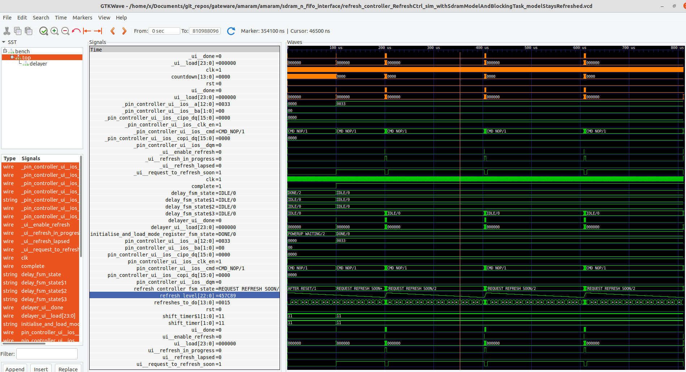

# amaram

This is a python library, providing RAM peripheral interfaces for amaranth language HDL projects.

Currently, only a n-async-FIFO interface for SDRAM is implemented.

## status

- As of 9 April 2022, tried building a minimal (incomplete) test. Initially the sdram clock freq limit was 50 MHz ish, but as of now it reports around 136-143 MHz - this is great! Way past what is needed to use the ram for what I want to use it for, and now pressing up againt the upper limit of speed for the ram that I have to hand (143 MHz). This speedup was achieved by some fifo structure changes, making async fifos be as small (and hence as fast) as possible. 
Next: Implement a hardware test. Perhaps I could try to read the value of a counter into the input of this DUT, and then read it back from the output of the DUT using a fifo-to-spi-read interface.

- As of 7 April 2022, the single-fifo interface tests good in simulations! Next, try it on the ulx3s board. What sort of tests could be done? This is the interface that would be great as the backend for the LUNA ILA mentioned back in Feb. After this is done, finish debugging/implementing the n-fifo interface.

- As of 21 Mar 2022, separately there are implementations of realistic refreshes, the top-level fifo interface, and read/writes (including a very nice pipelined readback mechanism) looks good in simulations. Next is to put it all together.

- As of 13 Mar 2022, can now write and read data to the sdram model, now need to 1) use a more realistic interface for the model, 2) double check the model is valid

- As of 9 Mar 2022, the refresh controller tests good; both by looking at the waveforms, and by the (newly restructured) sdram chip model. According to the .tim timing analysis file, for an uploadable test, the timing performance is `Info: Max frequency for clock '$glbnet$ecp5pll_sdram_clk': 167.08 MHz (PASS at 143.00 MHz)` - very encouraging! It looks like the 24(?) bit wide counter is the slowest path. Could we split that into a low-resolution and a high-resolution counter to speed things up? Now to move on to the other controllers.

- As of 2 Mar 2022, after a week or so of restructuring how testing is approached, I have arrived on a structure I like; see amaram/amaram/common/Delayer.py. This enables the most straightforward, concise and conventional way to implement formal verification, simulations and uploadable tests.

- As of 23 Feb 2022, split part of this project into a new `amtest` repo, so the code is more concise and reusable.

- As of 15 Feb 2022, moving from `test5_modified_ila_with_fifo_backend.py`, where the backend of the ila is implemented with a conventional fifo, to `test6_modified_ila_with_sdram_fifo.py`, where the backend of the ila is implemented with the sdram fifo. This is the big test, perhaps it could be broken down a bit more.

- As of 10 Feb 2022, we can now debug using the LUNA ILA (integrated logic analyser) library, via the amlib library! This records and displays on-FPGA signals.

- As of early Feb 2022, the ram-fifo interface passes simulation tests, but hardware tests are not yet implemented/working.

Test performance:

- On a ULX3S board: [test failed: too slow. Achieved 57 MHz but require 143 MHz]
	- so currently rewriting to rigorously solve this
- On a spartan6 board: [test not yet implemented]

## next steps
- add a demo use app, perhaps implementing the backend of a logic analyser using the LUNA interfaces
- Then, replace the backend of the LUNA interface
- speed up the Delayer() by following the ideas here https://web.archive.org/web/20170819093127/http://hamsterworks.co.nz/mediawiki/index.php/High_Speed_Frequency_Counter

## later steps
- add quality documentation, and perhaps a video of how it works
- add tests that run on the ULX3S board, and on a second board demonstrating that it can be cross-platform

## thoughts
- make the mcu fifo interface as close as possible to the amaranth fifo simulation interface?
- it seems hard to test! What's the simplest way? connect up to the backend of a logic analyser, then the input to a counter, and make sure no counts are skipped?

# Usage

Using vscode, open the `amaram.code-workspace` file, then use the `build debug` launch shortcuts as named below. See the `code-workspace` file to see the translation into command line arguments, as they al just call `setup.py` with various arguments.

Initially,

1. Make a `mcu_gui_interface.configjson` file following the `.example`.
2. In vscode as a debugging task, run `fpga upload-uart-passthru-binary`. This routes the uart signals to the ulx3s's esp32 microcontroller. Lots of informtion is printed to screen, and success or failure should be indicated
3. Run `mcu reflash-binary` to load the micropython operating system.

Then, and each time changes are made to fpga gateware,

1. Open the fpga test file such as `test3_from_luna_ula`, then run `fpga upload current file`. Alternatively, for fpga development run `fpga simulate current file` or `fpga generate current file`.

Then, and each time changes are made to mcu firmware,

1. Run `mcu update-firmware` to put this project's firmware on it. As demonstrated in `build.py`, this rsync's over the folder of `amaram/tests/ulx3s_gui_test/common/test_common` and the content of `amaram/tests/ulx3s_gui_test/mcu_firmware/source` to the root directory of the microcontroller. This will end by opening a repl window into the microcontroller. It's not as functional as the underlying `rshell` interface which can still be used manually.

Then, and each time changes are made to gui software,

1. Run `start gui` which also acts as the server for the wifi connection, then in the repl window type `import main`, which will start the mcu, which acts as the `client` for the connection. At this point the gui will work as a remote control, providing an interface to read/write spi registers, and to trigger other specific functions.

